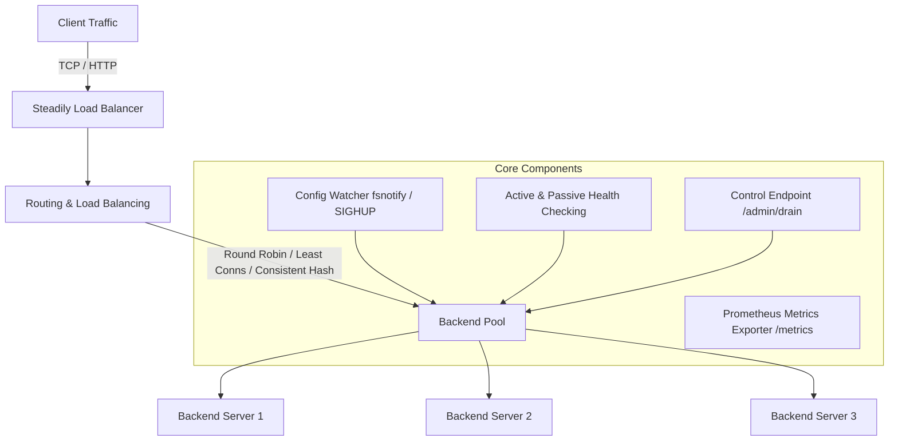

# Steadily Load Balancer

Steadily is an L4 (TCP) and L7 (HTTP) load balancer written in Go that distributes network traffic across backend servers, automatically detects failures via active and passive health checking, drains connection pools gracefully, and reloads configuration dynamically without dropping in-flight requests.

## Features

- **L4 and L7 Proxying**: Supports TCP byte streaming (L4) and HTTP header-aware routing, path-prefix matching, and automatic request retries (L7).
- **Load Balancing Algorithms**: Round-Robin, Least-Connections, and Consistent Hashing (using a 160-virtual-node ring for minimal key reshuffling).
- **Failover & Health Checking**: Periodic active HTTP/TCP health probes paired with immediate passive failure detection upon transport errors.
- **Graceful Connection Draining**: Backends marked for removal continue serving in-flight requests until completion or until a configurable timeout expires, while receiving no new requests.
- **Hot Configuration Reloading**: Dynamic YAML config reload via `fsnotify` file watching or `SIGHUP` signal handling without dropping active requests.
- **Prometheus Observability**: Pre-configured `/metrics` endpoint exposing request rates, error rates, per-backend latency histograms, active backends, and health check counters.

## Architecture



## Quickstart

### Prerequisites

- Go 1.22+
- Docker and Docker Compose

### Running with Docker Compose

Launch Steadily alongside 3 backend instances, Prometheus, and Grafana:

```bash
docker compose up -d --build
```

Access services at:
- **Proxy Endpoint**: `http://localhost:8080/`
- **Prometheus Metrics**: `http://localhost:9090/metrics`
- **Prometheus UI**: `http://localhost:9091`
- **Grafana Dashboard**: `http://localhost:3000` (pre-configured dashboard)

Run the backend kill demo to verify zero dropped requests during mid-traffic failure:

```bash
go run ./scripts/demo-kill
```

### Running Locally

```bash
# Build binary
go build ./cmd/steadily

# Run binary with config
./steadily -config steadily.yaml
```

## Configuration Reference

Steadily loads YAML configuration provided via `-config` flag or `STEADILY_CONFIG` environment variable.

```yaml
listen_address: ":8080"
metrics_address: ":9090"
mode: "l7" # "l4" or "l7"
algorithm: "round_robin" # "round_robin", "least_connections", "consistent_hashing"
consistent_hash_key: "header:X-User-ID" # "header:<Name>", "cookie:<Name>", or client IP
shutdown_timeout: "5s"
drain_timeout: "10s"

health_check:
  path: "/health"
  interval: "1s"
  timeout: "500ms"
  healthy_threshold: 1
  unhealthy_threshold: 1

backends:
  - name: "echo1"
    address: "echo1:8081"
    weight: 1
    draining: false
  - name: "echo2"
    address: "echo2:8082"
    weight: 1
  - name: "echo3"
    address: "echo3:8083"
    weight: 1

groups:
  - name: "main"
    backends: ["echo1", "echo2", "echo3"]

routes:
  - path_prefix: "/"
    group: "main"
```

## Admin Control API

Mark a backend as draining via HTTP POST:

```bash
curl -X POST "http://localhost:8080/admin/drain?backend=echo1"
```

## Running Tests and Benchmarks

```bash
# Unit and integration tests
go test ./...

# Code analysis
go vet ./...

# Chaos test suite
go run ./scripts/chaos

# Benchmark suite (updates docs/benchmarks.md)
go run ./scripts/bench
```

Measured throughput reaches up to 9,726 req/sec under 200 concurrent connections in in-process benchmarks (see [docs/benchmarks.md](docs/benchmarks.md)).

## Contributing

For guidelines on repository structure, invariants, and code conventions, see [AGENTS.md](AGENTS.md).

## License

This project is licensed under the MIT License - see the [LICENSE](LICENSE) file for details.
