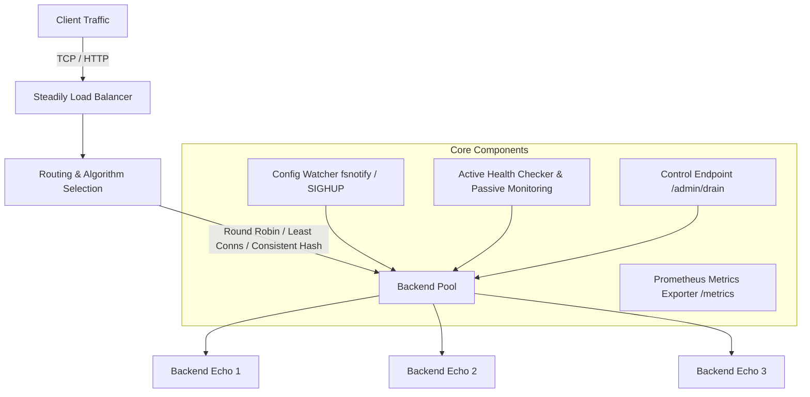
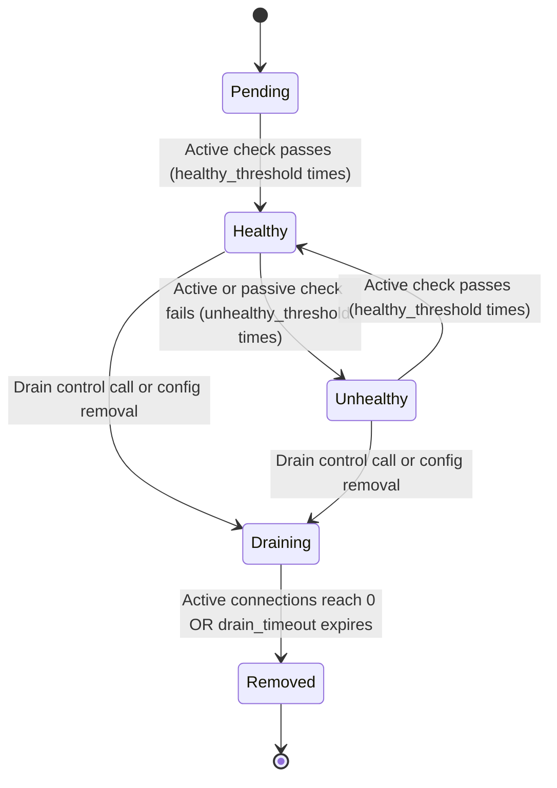

# Steadily Load Balancer Design

Steadily is a high-availability L4 (TCP) and L7 (HTTP) load balancer written in Go, engineered for zero-downtime traffic management, continuous connection draining, dynamic hot configuration reloading, and resilience during backend failures.

## System Architecture

## Load Balancing Algorithms

1. **Round Robin**: Distributes requests sequentially across healthy backends using atomic counter operations (`atomic.AddUint64`). It filters out unhealthy and draining backends before selecting the target index.
2. **Least Connections**: Tracks active in-flight requests per backend via atomic operations (`IncrConnections` and `DecrConnections`). Selects the healthy backend with the lowest currently active connection count.
3. **Consistent Hashing**: Hashes request attributes (configurable header, cookie, or remote client IP) onto a ring of 160 virtual nodes per backend using FNV-1a hashing. Binary searches the sorted ring to pick the destination backend. When a backend is added or removed, only `~1/N` of keys are remapped compared to `~(N-1)/N` with naive modulo hashing.

## Health Check State Machine

## Connection Draining and Hot Reload Design

1. **Connection Draining**: When a backend is removed from configuration or marked draining via `/admin/drain?backend=<name>`, its state transitions to `draining`. It immediately stops receiving new requests. Existing in-flight requests continue executing until completion or until `drain_timeout` expires, at which point the backend transitions to `removed`.
2. **Hot Config Reload**: Configuration changes trigger an atomic reload via `fsnotify` file watching or `SIGHUP` signal. Steadily updates backend pools, algorithms, and routing rules without dropping in-flight requests. Backends present in the old configuration but absent in the new configuration automatically enter draining mode rather than being dropped abruptly.

## L4 vs L7 Tradeoffs

- **L4 Proxying (TCP)**: Operates at the transport layer by bidirectionally copying bytes between client and backend sockets. Offers maximum raw throughput and minimal latency overhead, but cannot inspect HTTP headers or perform per-request retries.
- **L7 Proxying (HTTP)**: Operates at the application layer. Parses HTTP headers, handles path-prefix routing, injects `X-Forwarded-For` and `X-Request-ID` headers, supports consistent hashing on headers/cookies, and transparently retries requests on alternative backends upon upstream failures.

## Comparison to Industry Standard Load Balancers

| Feature | Steadily | Nginx | HAProxy | Envoy |
| :--- | :--- | :--- | :--- | :--- |
| **Language** | Go 1.22+ | C | C | C++ |
| **Hot Reload** | fsnotify / SIGHUP | SIGHUP (master-worker) | `haproxy -sf` | xDS gRPC API |
| **Connection Draining** | Automatic per-backend goroutine | Worker process drain | Server `drain` state | Dynamic health/drain state |
| **Consistent Hashing** | Virtual node ring (160 replicas) | `hash $arg_key consistent` | `balance ketama` | Ring hash / Maglev |
| **Observability** | Prometheus client_golang | Stub status / Nginx Plus | Stats socket / Prometheus | Native Prometheus metrics |

## Known Limitations

- **TLS Termination**: Steadily currently routes unencrypted HTTP/TCP traffic; TLS termination must be placed in front of Steadily or handled at backend origin.
- **Memory Footprint under Extreme Ring Sizes**: Consistent hashing virtual node ring is computed per-pool update; ring structures are re-built dynamically upon backend pool modification.
